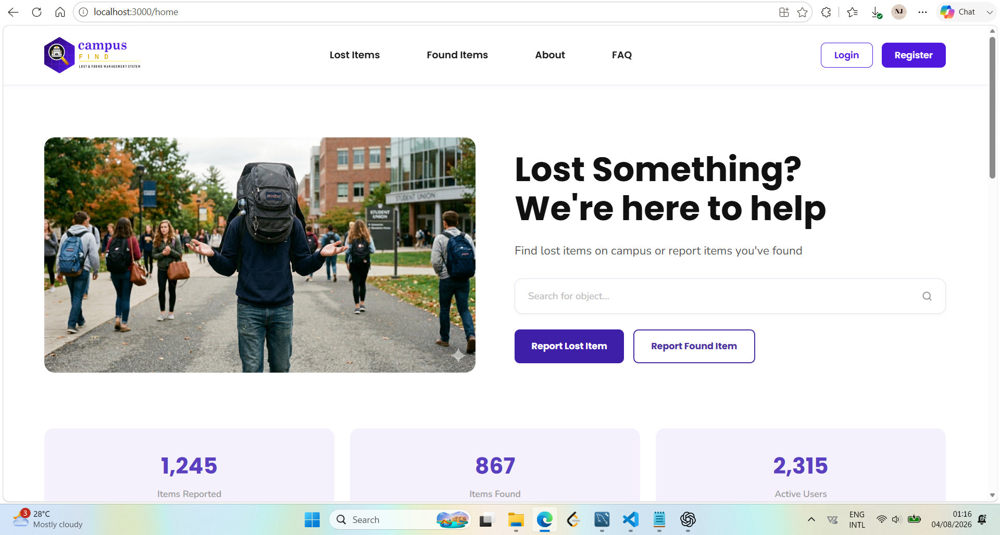
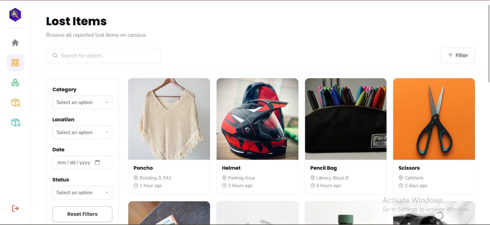
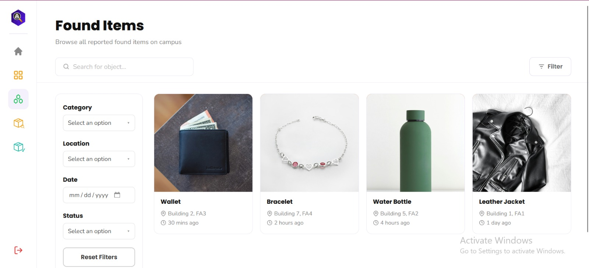
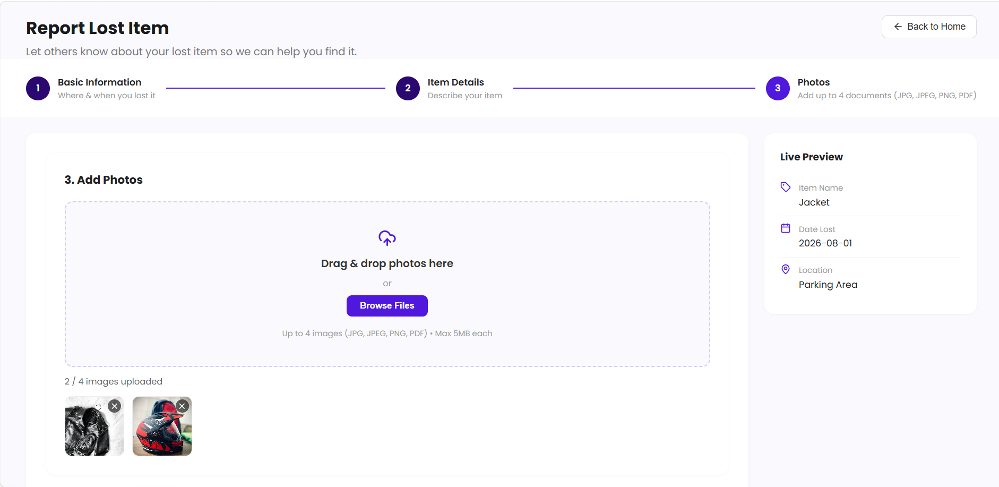
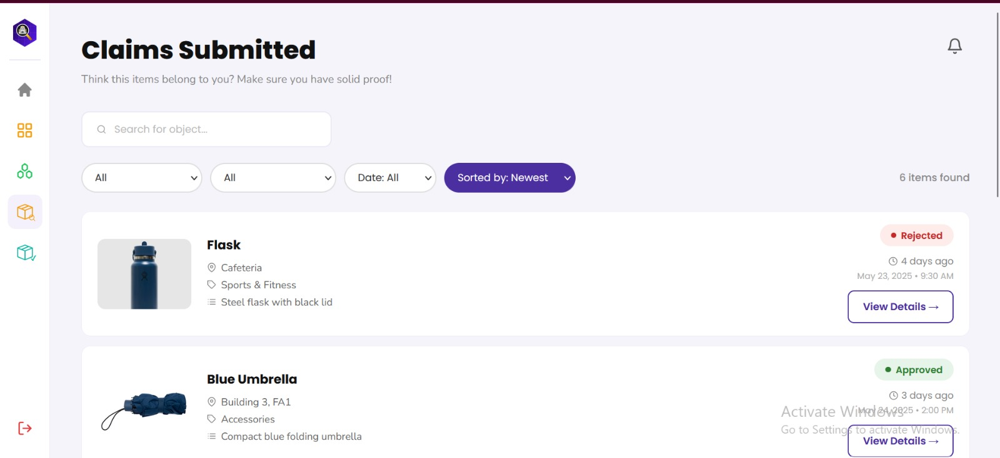
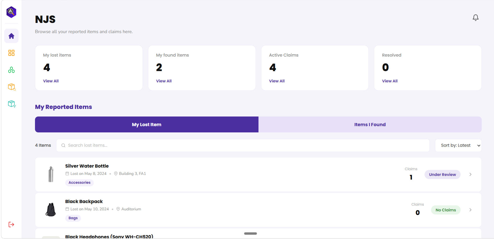

# Campus Find — Lost & Found Management System for IIUC

> A web-based Lost & Found Management System designed to help students and university members report, search, claim, and manage lost and found items on campus.

**Live Demo:** [FRONTEND_DEPLOYMENT_URL](https://git-lmfs-2.vercel.app/)

**Backend / API:** [BACKEND_DEPLOYMENT_URL](https://git-lfms.onrender.com/)

**Figma Design:** [UI_DESIGN_URL]https://www.figma.com/design/oUpW1vSoTB25MhJSTw19M1/LFMS_IIUC?node-id=1919-1544&t=77uozHmxBS9SQypK-1

---

## Overview

Campus Find is a Lost & Found Management System developed for the International Islamic University Chittagong (IIUC).

The system provides a centralised platform where users can report lost or found items, browse and search reported items, submit claims, provide supporting evidence, and track the status of their claims. Administrators can review reports and claims, manage submitted items, and oversee the overall system.

The goal of the system is to make the traditional campus lost-and-found process more organised, accessible, transparent, and efficient.

---

## Key Features

### User Features

- User registration and login
- Browse reported lost items
- Browse reported found items
- Search for items
- Filter items by relevant information
- Report lost items
- Report found items
- Upload item images and supporting documents
- Submit claims for found items
- Provide ownership evidence
- Track claim status
- View personal reported items
- View submitted claims
- View resolved claims
- Receive relevant notifications
- Manage user information

### Administrator Features

- Administrator dashboard
- Review reported lost and found items
- Approve or reject submitted reports
- Review submitted claims
- Approve or reject claims
- Monitor resolved claims
- Manage reported items and system records
- View relevant user and item information

---

## Technology Stack

| Category | Technology |
|---|---|
| Frontend | React.js |
| Backend | Node.js, Express.js |
| Database | MySQL |
| Image Storage | Cloudinary |
| API Communication | REST API |
| Version Control | Git & GitHub |
| Frontend Deployment | Vercel |
| Backend Deployment | Railway |
| UI/UX Design | Figma |

---

## System Architecture

Campus Find follows a client-server architecture consisting of a React-based frontend, an Express.js backend, and a MySQL database.

```text
User / Admin
     |
     v
React Frontend
     |
     | REST API
     v
Node.js + Express.js Backend
     |
     +-------------> MySQL Database
     |
     +-------------> Cloudinary
```

---

## Screenshots

### Login


### Home Page



### Lost Items



### Found Items



### Report Lost Item



### Submitted Claims



### User Dashboard



---

## Project Structure

```text
Campus-Find/
|
|-- backend/
|   |-- controllers/
|   |-- models/
|   |-- routes/
|   |-- middleware/
|   |-- config/
|   |-- uploads/
|   |-- server.js
|   `-- package.json
|
|-- frontend/
|   |-- public/
|   |-- src/
|   |   |-- components/
|   |   |-- pages/
|   |   |-- assets/
|   |   `-- ...
|   `-- package.json
|
|-- screenshots/
|   |-- login.png
|   |-- home.png
|   |-- lost_items.jpeg
|   |-- found_items.jpeg
|   |-- report_lost.png
|   |-- claim_submitted.jpeg
|   `-- user_dashboard.png
|
`-- README.md
```

---

## Getting Started

### Prerequisites

Make sure the following are installed on your system:

- Node.js
- npm
- MySQL
- Git

### Backend Setup

Navigate to the backend directory:

```bash
cd backend
```

Install the required dependencies:

```bash
npm install
```

Create a `.env` file and configure the required environment variables.

Example:

```env
PORT=5000

DB_HOST=your_database_host
DB_USER=your_database_user
DB_PASSWORD=your_database_password
DB_NAME=your_database_name

CLOUDINARY_CLOUD_NAME=your_cloudinary_cloud_name
CLOUDINARY_API_KEY=your_cloudinary_api_key
CLOUDINARY_API_SECRET=your_cloudinary_api_secret
```

Start the backend server:

```bash
npm start
```

### Frontend Setup

Open another terminal and navigate to the frontend directory:

```bash
cd frontend
```

Install the required dependencies:

```bash
npm install
```

Configure the frontend environment variables according to the project configuration.

Start the development server:

```bash
npm start
```

---

## Environment Variables

Environment variables contain configuration and sensitive credentials required by the application.

Do not commit `.env` files or API credentials to the repository.

For local development, configure the required variables in the appropriate environment files for the frontend and backend.

---

## Deployment

The application is deployed as separate frontend and backend services.

### Frontend

The React frontend is deployed using Vercel.

**Live Frontend:** YOUR_FRONTEND_DEPLOYMENT_URL

### Backend

The Node.js and Express.js backend is deployed separately.

**Backend API:** YOUR_BACKEND_DEPLOYMENT_URL

The frontend communicates with the deployed backend through REST API endpoints.

---

## Database

Campus Find uses MySQL as its relational database.

The database stores information related to:

- Users
- Lost items
- Found items
- Categories
- Locations
- Claims
- Claim status
- Related system records

Database credentials are configured through environment variables and should not be exposed publicly.

---

## Image Storage

Item images and uploaded files are handled using Cloudinary rather than being stored directly inside the source repository.

This allows uploaded media to be managed separately from the application's source code and database.

---

## Development Workflow

The project was developed using a collaborative Git-based workflow.

```text
Feature Development
       |
       v
Local Testing
       |
       v
Git Commit
       |
       v
Push to Remote Repository
       |
       v
Integration / Merge
       |
       v
Deployment
```

Git and GitHub are used for source-code version control and team collaboration.

---

## Future Improvements

Possible future improvements include:

- Improved item-matching functionality
- Advanced search and filtering
- More sophisticated notification mechanisms
- Enhanced administrator controls
- Improved analytics and reporting
- Mobile application support
- Additional security and authentication improvements
- More advanced claim verification mechanisms

---

## Team

**Team Campus Find**

Developed as part of the Software Engineering project at the Department of Computer Science and Engineering, International Islamic University Chittagong (IIUC).

### Team Members

- Nusrath Jahan Shawon
- Tasfia Ullah
- Arifa Jahan

---

## Design

The UI/UX design and design concepts for Campus Find were developed in Figma.

**Figma Design:**
https://www.figma.com/design/oUpW1vSoTB25MhJSTw19M1/LFMS_IIUC?node-id=1919-1544&t=77uozHmxBS9SQypK-1

---

## License

This project was developed as an academic project for educational purposes.

---

## Acknowledgements

- International Islamic University Chittagong (IIUC)
- Department of Computer Science and Engineering
- Software Engineering course/project supervision
- The open-source technologies and libraries used throughout the project
